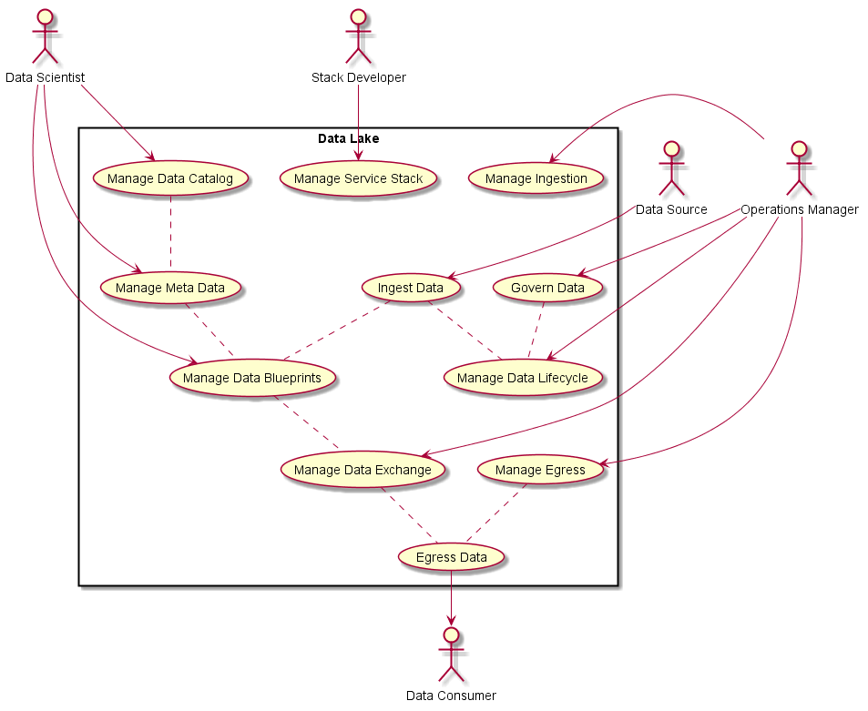
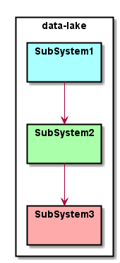
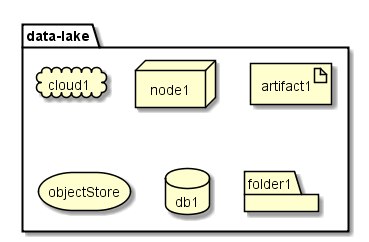
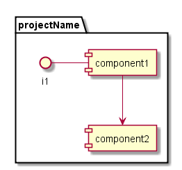

A Data Lake is an unstructured data store. It has no schema, or structure. Data is stored in 
its raw format. 

## Chacateristics of a DataLake
* Data Lineage
* Data Governance
* Accessibility - security, who has access to what?
* Flexibility -  
* Ingestion - Legacy data cannot be moved must be connected. There needs to be a Data layer abstract that allows 
  for plugins to other data sources (NFS, HDFS, Object storage, Public cloud). This is similar to the Cloud
  layer for other architectures, but it is different than just the cloud layer. It would sit on top 
  of the cloud layer. It needs to have the ability to extend the SDS(Software Defined Storage) to create a
  SDD (Software Defined Data).
* Metadata management
* Auditability -
* BigDL gives a distributed Spark and hadoop
* Blue Data???

## References
* [Knowledgent](https://knowledgent.com/whitepaper/design-successful-data-lake/)
* [Blue Granite](https://www.blue-granite.com/blog/bid/402596/top-five-differences-between-data-lakes-and-data-warehouses)
* [Zaloni](https://www.zaloni.com/platform/)
* [Martin Fowler](https://martinfowler.com/bliki/Datensparsamkeit.html)
* [Martin Fowler 2](https://martinfowler.com/bliki/DataLake.html)

## [Users](Actors)

 * _Actor_

## High level Use Cases

* _UseCases_

## Logical Architecture

The system has a typical service layer, cloud layer and hardware layer architecture. Additionally there
is a Software Defined Data layer that is an extenstion of the traditional Software Defined Storage(SDD) 
Subsystem. The SDD abstracts typical storage access and see it as a data fabric/plane that the services
can access reliably and consistently. This contains a set of connectors and plugins for the different 
filesystems, types of storage, etc...

_Systems_

## Process Architecture

## Deployment model

_Description_

## Physical Architecture

_Description_

_Systems_

